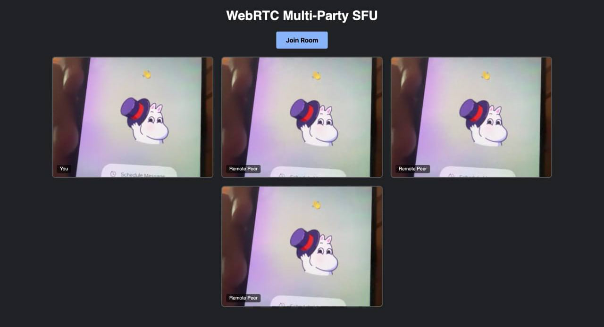
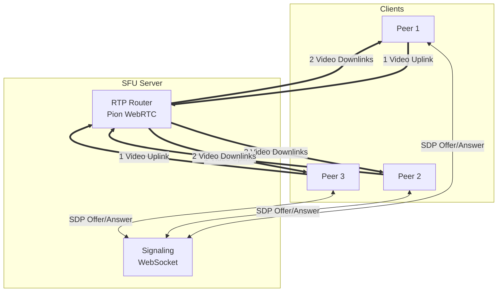

# Stream Relay: WebRTC SFU


A high-performance, real-time video/audio conferencing server implemented in Go. 

Stream Relay acts as a **Selective Forwarding Unit (SFU)**. Instead of relying on a peer-to-peer Full Mesh topology (which consumes excessive client bandwidth), this server receives a single media stream from each participant and efficiently routes (relays) it to all other participants in the room.

> 

## ✨ Key Engineering Highlights

*   **SFU Architecture:** Solves the $O(N^2)$ bandwidth problem of Full Mesh networks. Clients only upload their stream **once**, and the server handles the distribution, reducing client-side CPU and network load.
*   **Zero-Decoding RTP Routing:** The server does not decode or re-encode video frames. It reads raw **RTP packets** from the publisher and copies/routes them directly to subscribers using Pion's `TrackLocalStaticRTP`, ensuring sub-second latency.
*   **RTCP PLI Requests:** Implements proactive RTCP Picture Loss Indication (PLI) generation. The server periodically requests keyframes from senders to ensure new participants immediately receive a decodable video stream without artifacts.
*   **Thread-Safe State Management:** Built heavily on Go's concurrency primitives (`sync.RWMutex`). Safely handles dynamic room states (peers joining, leaving, renegotiating SDPs) across multiple concurrent WebSocket goroutines without race conditions.
*   **WebSocket Signaling:** Uses `gorilla/websocket` for instant out-of-band exchange of Session Description Protocol (SDP) Offers and Answers.

## 🏗 System Architecture



## 🛠 Tech Stack

*   **Backend:** Go (Golang)
*   **WebRTC Engine:** [Pion WebRTC](https://github.com/pion/webrtc) (A pure Go implementation of the WebRTC API)
*   **Signaling:** Gorilla WebSockets
*   **Frontend:** Vanilla JavaScript & HTML5 (`getUserMedia`, `RTCPeerConnection`)

## 🚀 Getting Started

### Prerequisites
*   Go 1.25 or higher
*   A modern web browser (Chrome, Firefox, Safari)

### 1. Installation

Clone the repository and download Go dependencies:

```bash
git clone https://github.com/yourusername/stream-relay.git
cd stream-relay
go mod download
```

### 2. Run the Server

Start the SFU server:

```bash
go run cmd/server/main.go
```
*The server will start listening on port `8080`.*

### 3. Test the Application

1. Open `http://localhost:8080` in your web browser.
2. Grant the browser permission to access your camera.
3. Click the **"Join Room"** button. Your local video will appear.
4. **Open a new tab** or a different browser and navigate to `http://localhost:8080`.
5. Click **"Join Room"** again. You will now see the video stream being routed from the first tab to the second, and vice-versa, seamlessly through the Go backend!

*Note: Browsers require a secure context to access the camera. `localhost` is considered secure, but if you deploy this to a remote server, you **must** serve the frontend via HTTPS.*

## 📁 Code Structure

*   `cmd/server/`: Application entry point.
*   `internal/sfu/`: Core WebRTC logic. 
    *   `room.go`: Manages the collection of peers and broadcasts RTP packets.
    *   `peer.go`: Handles individual `PeerConnection` states, track subscriptions, and RTCP loops.
*   `internal/signal/`: Handles the HTTP file server and WebSocket upgrades for SDP negotiation.
*   `web/public/`: Static vanilla JS client for testing.

## 📜 License

This project is licensed under the MIT License - see the [LICENSE](LICENSE) file for details.